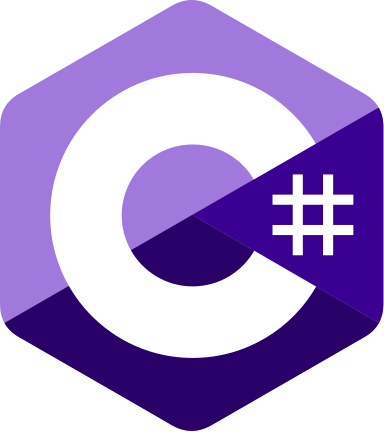

  <table>
    <tr>
      <td width="130px" align="center">
        
      </td>
      <td>
        <h1 align="center">
          
        </h1>
        

          
          
          
          
        

      </td>
    </tr>
  </table>

Hi! I'm **Carlos Sánchez Muñoz**, a computer scientist and mathematician from Spain.

### 🚀 Studies, Research & Experience

- 🎓 Graduated in **Mathematics** and **Computer Science** at the University of Granada.
- 🔬 Completed MSc degrees in both **Computer Science** and **Artificial Intelligence**.
- 🔭 Conducted research at the University of Granada (both as a Bachelor's and Master's student).
- 👨🏻‍💻 Currently working as a **data scientist and IT specialist** in a biotech company.
- 💻 Passionate about **problem-solving**, **clean code**, and **real-world applications** of data science.

### ☄️ Languages & Technologies

  <code></code>
  <code></code>
  <code></code>
  <code></code>
  <code></code>
  <code></code>
  <code></code>
  <code></code>
  <code></code>
  <code></code>
  <code></code>
  <code></code>
  <code></code>
  <code></code>
  <code></code>
  <code></code>
  <code></code>
  <code></code>
  <code></code>
  <code></code>

### ⚡ Stats

  

    
    
  

  

